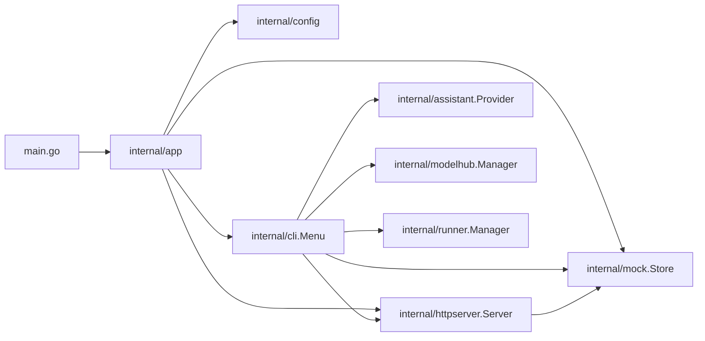
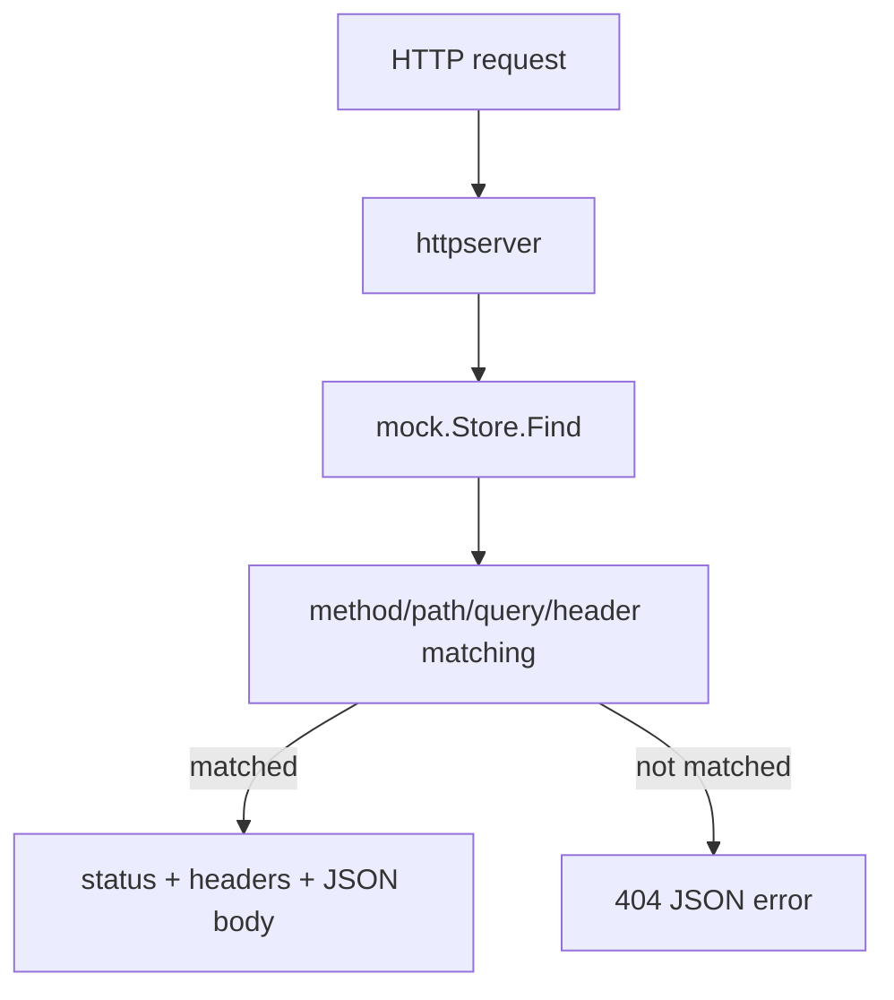
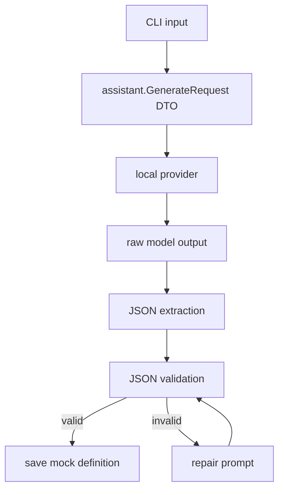

# GoFaux 2.0 Architecture

GoFaux now uses a production-style Go layout centered on internal modules. The goal is to keep domain behavior independent from CLI, HTTP, and local AI provider details.

## Module Layout

```text
.
├── main.go
├── internal
│   ├── app
│   │   └── app.go
│   ├── assistant
│   │   ├── types.go
│   │   ├── prompt.go
│   │   ├── template.go
│   │   ├── ollama.go
│   │   ├── openai_compatible.go
│   │   └── http.go
│   ├── cli
│   │   └── menu.go
│   ├── config
│   │   └── config.go
│   ├── httpserver
│   │   └── server.go
│   ├── modelhub
│   │   ├── catalog.go
│   │   └── manager.go
│   ├── runner
│   │   └── manager.go
│   └── mock
│       ├── model.go
│       ├── matcher.go
│       ├── json.go
│       └── store.go
├── examples
│   └── ecommerce.gofaux.json
└── docs
```

## Responsibility Boundaries

| Module | Responsibility | Should not do |
|---|---|---|
| `internal/mock` | Core domain model, validation, matching, persistence | Read terminal input, call AI, run HTTP server |
| `internal/assistant` | Local AI DTOs, prompt construction, providers, fallback generation | Store mocks, serve HTTP requests |
| `internal/httpserver` | HTTP endpoints, mock response serving, health/inspection endpoints | Ask the user questions, call AI providers |
| `internal/modelhub` | Curated model catalog, model file downloads, downloaded model inventory | Run inference or implement prompt generation |
| `internal/runner` | Managed llama.cpp-compatible local runner installation/startup | Define mock semantics or CLI behavior |
| `internal/cli` | Interactive terminal workflow | Implement matching algorithms or provider internals |
| `internal/config` | Environment/file-based configuration and local settings persistence | Create stores or start servers |
| `internal/app` | Dependency wiring | Contain business logic |
| `main.go` | Process entry point | Contain application logic |

## Runtime Flow



## Local Settings

GoFaux reads configuration from two places:

1. `.gofaux.settings.json` for local remembered settings.
2. Environment variables for temporary overrides.

Environment variables win over the settings file. This means evaluation scripts can override configuration without modifying the user's saved local preferences.

The AI provider/model choice can be changed inside the CLI menu and saved automatically.

## Mock Request Flow



## AI Authoring Flow



## Why This Structure Helps the Thesis

This layout supports a clean implementation chapter:

1. The mock engine can be explained as the artifact core.
2. The assistant module can be evaluated independently from the HTTP server.
3. Runtime performance can be benchmarked without AI inference in the request path.
4. Different local AI providers can be compared without changing the mock server.
5. Persistent configurations make experiments reproducible.
6. Local AI settings can be selected through the application instead of requiring paid external services.
7. Model files can be pulled by GoFaux itself.
8. A managed local runner can start downloaded GGUF models without requiring the user to install Ollama or LM Studio.

Thesis-ready sentence:

> The implementation was reorganized into internal modules to separate the domain model from infrastructure concerns. This separation makes the artifact easier to maintain and supports independent evaluation of request matching, persistence, HTTP serving, and AI-assisted authoring.
